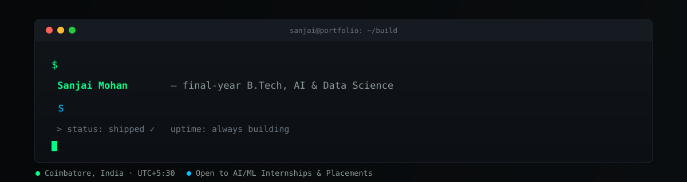

<div align="center">



[](https://github.com/sanjaim25)

</div>

---

## 🚀 About Me

Final-year **B.Tech (AI & Data Science)** student in Coimbatore, India. I build AI systems end-to-end — model, backend, and interface — and I'd rather ship something small than demo something that doesn't run.

**🌐 Portfolio:** [sanjai25.vercel.app](https://sanjai25.vercel.app) &nbsp;|&nbsp; **🎯 Status:** Open to AI/ML internships & campus placements

---

## 🛠️ Tech Stack

### Languages & Frameworks


### AI / ML Tools


### Motion & Animation


---

## 💡 Projects

Shipped work first, active builds at the end. **Click a title to expand.**

<details open>
<summary><b>🖼️ AI Caption Generator</b> — Gemini Vision · Flask · HTML/CSS</summary>
<br>

Accepts any image and returns five caption styles — descriptive, poetic, social-ready, SEO-optimized, and minimal — in under two seconds. One-click copy, zero extra steps.

**Why it works:** most caption tools give you one style and make you regenerate; this gives five in one call, so the output is a shortlist, not a gamble.

**Demonstrates:** multimodal API integration and UX-conscious design.

**[→ View Repository](https://github.com/sanjaim25/ai_caption_generator)**

</details>

<details>
<summary><b>💬 AI Quote Generator</b> — LLaMA 3 · Ollama · Flask</summary>
<br>

Fully offline generative AI — no cloud dependency, no API key, no recurring cost. LLaMA 3 runs locally via Ollama. Enter any topic, receive a contextual motivational quote in roughly three seconds.

**Demonstrates:** local LLM deployment and on-device inference, without leaning on a hosted API to make the demo work.

**[→ View Repository](https://github.com/sanjaim25/ai_quote_generator)**

</details>

<details>
<summary><b>💳 Credit Card Fraud Detection</b> — Scikit-Learn · Pandas · Jupyter</summary>
<br>

End-to-end ML pipeline on real financial data. Addressed severe class imbalance with SMOTE, benchmarked four classifiers, and optimized for recall over accuracy — because a missed fraud costs more than a false alert, and a model that just chases accuracy will quietly learn to predict "not fraud" every time.

**Demonstrates:** the full ML lifecycle from EDA through evaluation, and picking the right metric for the actual cost of being wrong.

**[→ View Repository](https://github.com/sanjaim25/credit_card_fraud_detection)**

</details>

<details>
<summary><b>😀 Real-Time Emotion Detection</b> — OpenCV · CNN · FER-2013</summary>
<br>

Live webcam feed classified across seven emotion categories in real time. CNN trained on FER-2013, with OpenCV handling face localization ahead of classification.

**Demonstrates:** a production computer vision pipeline with real-time inference constraints, not just an offline notebook accuracy score.

**[→ View Repository](https://github.com/sanjaim25/emotion_detection)**

</details>

<details>
<summary><b>📡 NetPulse</b> — JavaScript · CSS · HTML</summary>
<br>

A responsive network monitoring dashboard with real-time visual feedback for connection status.

**Demonstrates:** frontend architecture without a framework — plain JS state management and layout.

**[→ View Repository](https://github.com/sanjaim25/netpulse)**

</details>

<details>
<summary><b>🖌️ EnhanceX</b> — FastAPI · Next.js 14 · Real-ESRGAN · GFPGAN <i>(active build)</i></summary>
<br>

AI image enhancement platform — upscaling with Real-ESRGAN, face restoration with GFPGAN, FastAPI backend, Next.js 14 frontend.

**Shipped:** core upscaling + restoration pipeline, working end-to-end.
**In progress:** GPU detection, a Celery task queue, WebSocket progress updates, API auth, and a UI overhaul.

**Demonstrates:** production-grade ML serving architecture and async job processing.

</details>

<details>
<summary><b>🧭 Skill RPG AI</b> — Flask · RAG · ChromaDB · Ollama (LLaMA 3) <i>(active build)</i></summary>
<br>

A RAG-powered learning roadmap generator — describe a skill you want to learn, and it retrieves and synthesizes a structured path using a local LLaMA 3 model and a ChromaDB vector store.

**Status:** retrieval pipeline works; rebuilding in staged phases toward portfolio-ready quality (better chunking strategy, evaluation of retrieval relevance, and a cleaner UI).

**Demonstrates:** retrieval-augmented generation and local vector search pipelines.

</details>

<details>
<summary><b>📖 Interactive Portfolio Site</b> — React · TypeScript · GSAP · Framer Motion · Lenis <i>(active build)</i></summary>
<br>

A book-themed personal portfolio — six distinct page transitions (shatter/split, curtain wipe, zoom-morph, rotate-flip, glitch cut, slide-stack), Lenis inertia scroll, and cursor physics on a dark indigo/cyan visual system.

**Status:** transitions built and working individually; wiring them into a single consistent page-routing flow next.

**Demonstrates:** advanced frontend motion design and interaction engineering.

</details>

---

## 🐍 Contribution Snake

<div align="center">


</div>

---

## 🔥 GitHub Streak

<div align="center">

[](https://github.com/sanjaim25)

</div>

---

## ⏳ Currently

```yaml
Status        : Actively interviewing
Available for : AI/ML Internships · Full-Stack AI Roles · Research Projects
Open to       : Freelance · Open-source contributions · Mentorship
Location      : Coimbatore, India  (UTC+5:30)
Response time : Within 24 hours
```

---

## 🤝 Connect

<div align="center">

[](https://github.com/sanjaim25)
[](https://github.com/sanjaim25)

If something here was useful, a ⭐ is appreciated. If you want to collaborate, open an Issue or reach out directly.

<br/>


</div>

<!--
  Recent Activity / Blog sections removed until the GitHub Action feeding
  them is actually wired up — an empty <!--START/END--> block is more
  visible (and worse) in source view than no block at all.
  Re-add when live:

  ## 🚀 Recent Activity
  <!--START_SECTION:activity-->
  <!--END_SECTION:activity-->

  ### Latest Blog Posts
  <!-- BLOG-POST-LIST:START -->
  <!-- BLOG-POST-LIST:END -->
-->
